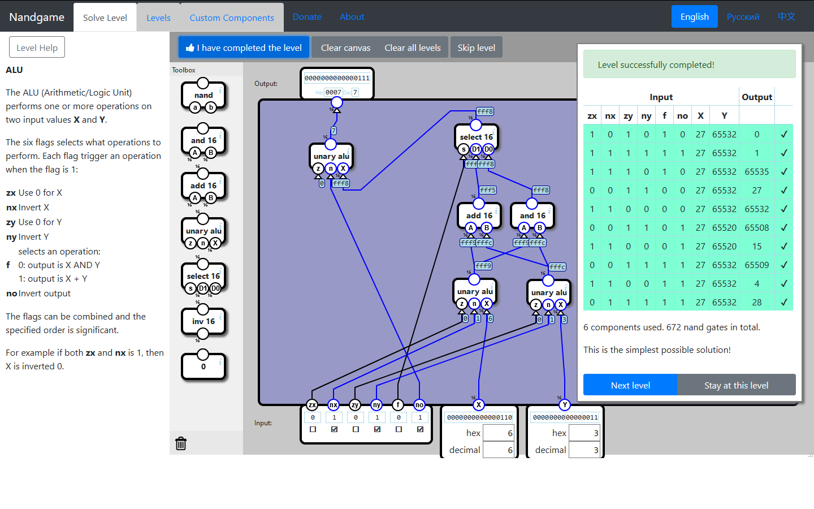
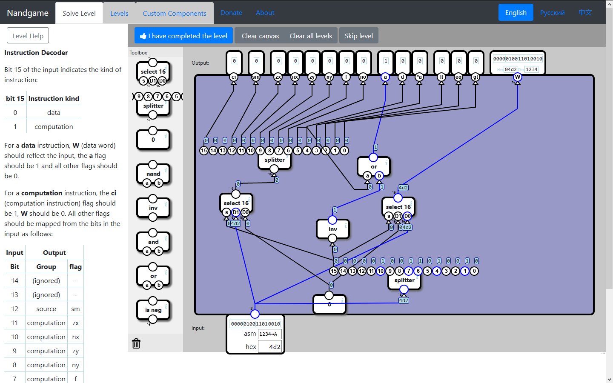
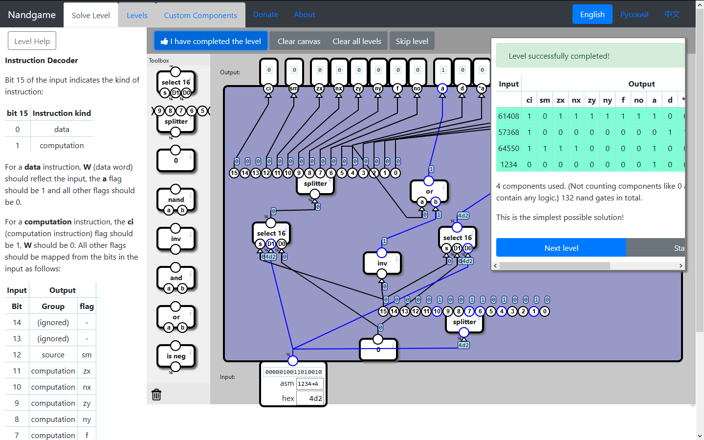

# NandGame-Solutions
Solutions to the https://nandgame.com/ game.

# NandGame Solutions

## 1-2 Invert

## 1-2 And

## 1-3 Or

## 1-4 Xor

## 2-1 Half Adder

## 2-2 Full Adder

## 2-3 Multi-bit Adder

## 2-4 Increment

## 2-5 Subtraction

## 2-6 Equal to Zero

## 2-7 Less Than Zero

## 3-1 Selector

## 3-2 Switch

## 4-1 Latch

## 4-2 Data Flip-Flop (non-optimal)

## 4-3 Register

## 4-4 Counter

## 4-5 RAM

## 5-1 Unary ALU

## 5-2 ALU

## 5-3 Opcodes

## 5-4 Condition

## 6-1 Combined Memory

## 6-2 Instruction Decoder

## 6-3 Control Unit

## 6-4 Program Engine

## 6-5 Computer

## 6-6 Input and Output

